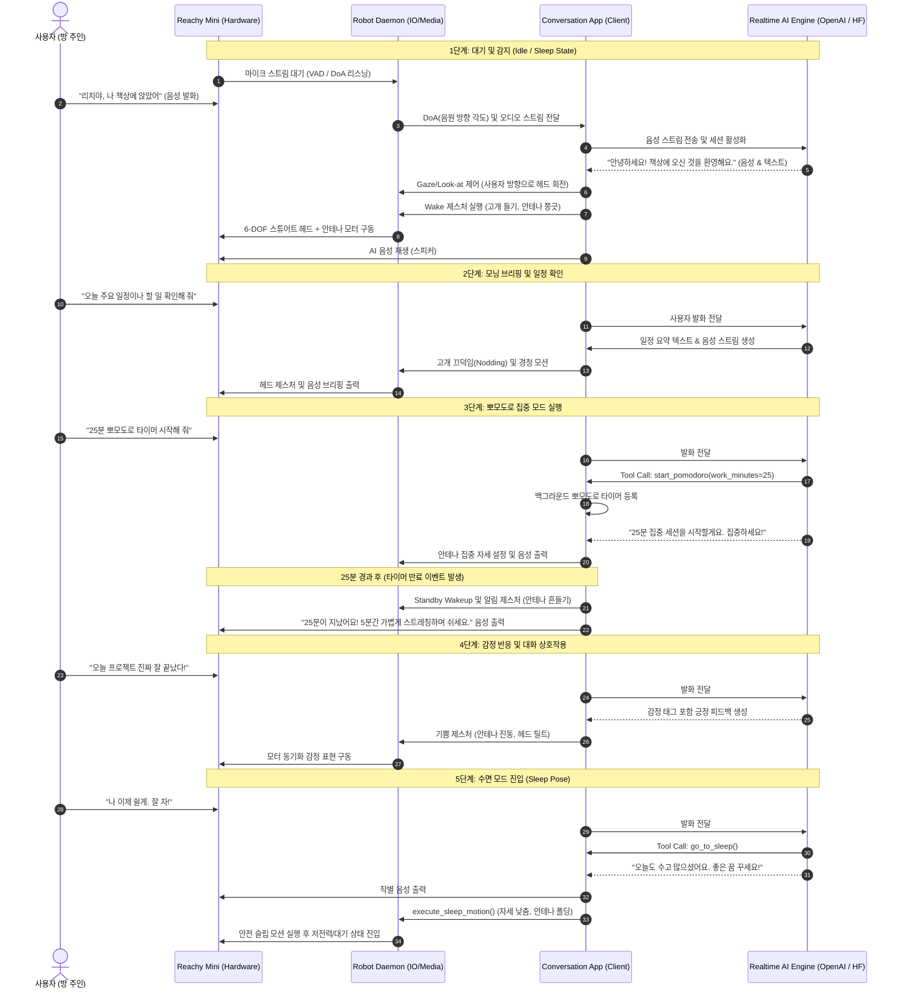

# Reachy Mini 시나리오 정의서: 개인 방 스마트 데스크 동반자 (DeskMate)

본 문서는 Reachy Mini의 하드웨어 특성(9-DOF 기구부, 6-DOF 스튜어트 플랫폼, 마이크 어레이, 카메라, 안테나 등)과 실시간 양방향 대화형 AI(OpenAI Realtime API / Hugging Face)를 결합하여, 개인 방(서재, 작업실, 홈 오피스)에서 사용자를 지원하는 스마트 데스크 비서 및 감정 교류 동반자 시나리오 정의서입니다.

---

## 1. 시나리오 개요

* **시나리오명**: AI 기반 감정 반응형 스마트 데스크 동반자 (DeskMate)
* **적용 분야**: 개인 서재, 데스크탑 작업 환경, 개인 연구실/작업실, 홈 오피스
* **핵심 목표**: 
  - 사용자가 책상에 앉거나 로봇을 호출할 때 음원 방향(DoA: Direction of Arrival)을 추적하여 시선을 맞추고(Look-at),
  - 자연스러운 한국어 실시간 음성 대화로 일정 브리핑, 업무/공부 집중 타이머(뽀모도로), 정보 질의응답을 수행하며,
  - 6-DOF 헤드 모션과 2-DOF 안테나 제스처를 통해 감정 교류 및 상태 피드백을 제공하는 몰입형 데스크 동반자 경험 구현.

---

## 2. 시나리오 구현을 위한 필수 기술 체크리스트

본 시나리오의 완벽한 작동(인식, 제어, 대화형 AI, 미디어 통신, 안전)을 지원하기 위한 핵심 기술 요소 목록입니다.

### 2.1. 인지 및 감지 기술 (Perception & Detection)
- [x] **음원 방향 추적 (Sound DoA - Direction of Arrival)**
  - 마이크 어레이 채널 간 신호 도달 시간차(TDoA) 분석을 통한 화자 수평 각도(Azimuth) 실시간 추정.
- [x] **사용자 안면 인식 및 3D 좌표화 (Face Detection & 3D Mapping)**
  - 카메라/USB 웹캠 비전 프레임 기반 YuNet ONNX 실시간 얼굴 랜드마크(양 눈, 코) 추출 및 핀홀/IPD 기하학 기반 3D 공간 좌표 $(X, Y, Z)$·시선 각도 산출.
- [x] **실시간 음성 활동 감지 (Server-side & Local VAD)**
  - 사용자의 발화 시작 및 종료를 지연 없이 감지하여 즉각적인 턴테이킹(Turn-taking) 및 발화 인터럽트(Barge-in) 지원.

### 2.2. 기구 제어 및 모션 기술 (Kinematics & Motion Control)
- [x] **스튜어트 플랫폼 6자유도 기구학 (6-DOF Stewart Platform Kinematics)**
  - 헤드 6-DOF 역기구학(IK) 및 순기구학(FK) 계산을 통한 정밀한 위치·자세 제어.
- [x] **타겟 추적 시선 제어 (Sound-Gaze & Look-at Control)**
  - DoA 각도 및 목표 좌표를 기반으로 부드러운 가감속 궤적(Trajectory)을 생성하여 화자 방향으로 헤드 정렬.
- [x] **감정 표현 안테나 제어 (2-DOF Antenna Emotion Motion)**
  - 감정 상태(기쁨, 생각 중, 집중, 경청, 졸림 등)에 따른 독립적인 2-DOF 안테나 제스처 및 진동 표현.
- [x] **모터 동기화 제어 및 안전 자세 (Multi-Servo Sync & Safe Pose)**
  - 스튜어트 플랫폼 6개 액추에이터 동기화 구동 및 슬립/스탠바이 전환 시 안전 자세(Sleep Pose) 복귀.

### 2.3. 대화형 AI 및 도구 연동 기술 (Interactive AI & Tools)
- [x] **초저지연 실시간 음성 파이프라인 (Realtime Speech Pipeline)**
  - WebSocket 기반 오디오 스트리밍을 통한 양방향 실시간 한국어 음성 대화 (`gpt-4o-realtime-preview`).
  - 24 kHz 오디오 실시간 리샘플링 및 입출력 동기화.
- [x] **스탠바이 / 웨이크 상태 머신 (Standby & Wake State Machine)**
  - 음성 호출어("리치야", "안녕") 또는 대기 명령("잠깐 쉬어", "자러 가자")에 따른 상태 전환 루프.
- [x] **작업 집중 및 생산성 도구 (Productivity Tools)**
  - 백그라운드 뽀모도로 타이머(작업 25분 / 휴식 5분 자동 전환 및 음성 안내).
  - 대화형 백그라운드 작업 관리 및 알림 기능.

### 2.4. 미디어 및 통신 기술 (Media & Communication)
- [x] **초저지연 양방향 통신 백엔드 (WebRTC / WebSocket / GStreamer)**
  - 로봇 데몬과 AI 클라이언트 간 제어 명령 및 오디오 스트림의 저지연 전달.
- [x] **원격 데몬 연동 및 환경 설정**
  - 로봇 호스트(`REACHY_MINI_HOST`) 및 포트 설정을 통한 유연한 로컬/원격 데몬 연결.

### 2.5. 하드웨어 보호 및 안전 기술 (Safety & Fallback)
- [x] **종료 시 안전 슬립 모션 (Graceful Sleep on Exit)**
  - `Ctrl+C` 등 비정상/정상 프로세스 종료 시 `go-to-sleep` 안전 모션을 실행하여 기구부 처짐 방지.
- [x] **도구 오류 격리 (Tool Exception Graceful Degradation)**
  - 외부 도구 호출 실패 시 세션 중단 없이 에러 메시지를 컨텍스트로 반환하여 자연스러운 대화 유지.

---

## 3. 사용자 인터랙션 시나리오 상세 흐름

```
+-----------------------------------------------------------------------------------+
| 1단계: 대기 및 호출 (Idle & Wake)                                                  |
| - 로봇이 슬립/스탠바이 상태에서 마이크 입력 대기                                   |
| - 사용자가 "리치야, 나 책상에 앉았어" 호출                                        |
| - DoA로 사용자 방향 추적 -> 기상 제스처(안테나 기립, 고개 들기) 및 아이컨택        |
+-----------------------------------------------------------------------------------+
                                      │
                                      ▼
+-----------------------------------------------------------------------------------+
| 2단계: 모닝 브리핑 및 일정 확인 (Morning Briefing)                                |
| - 로봇: "좋은 아침이에요! 오늘 예정된 일정과 할 일을 확인해 드릴까요?"            |
| - 사용자: "오늘 중요한 미팅이랑 작업 일정 알려줘"                                 |
| - 로봇: 헤드를 가볍게 끄덕이며 일정 요약 전달 및 오늘 목표 설정 제안              |
+-----------------------------------------------------------------------------------+
                                      │
                                      ▼
+-----------------------------------------------------------------------------------+
| 3단계: 작업 집중 및 뽀모도로 타이머 (Focus & Pomodoro)                             |
| - 사용자: "지금부터 25분간 코딩 집중할게. 뽀모도로 시작해 줘"                     |
| - 로봇: "네, 25분 집중 타이머를 시작합니다. 파이팅이에요!" (안테나 집중 모드)      |
| - 25분 경과 후: 로봇이 스탠바이에서 자동 기상하여 스트레칭 및 5분 휴식 알림 권유 |
+-----------------------------------------------------------------------------------+
                                      │
                                      ▼
+-----------------------------------------------------------------------------------+
| 4단계: 감정 교류 및 자유 대화 (Emotional Interaction)                              |
| - 사용자: "오늘 개발 생각보다 잘 풀린다! 기분 최고네"                             |
| - 로봇: 안테나를 빠르게 파닥거리며 기쁨 제스처 + 공감 멘트 전달                   |
| - 사용자 발화 도중 인터럽트(Barge-in) 시 즉시 음성 출력을 멈추고 경청 자세 전환   |
+-----------------------------------------------------------------------------------+
                                      │
                                      ▼
+-----------------------------------------------------------------------------------+
| 5단계: 수면 및 대기 복귀 (Go to Sleep & Standby)                                  |
| - 사용자: "오늘 작업 끝났어. 이제 자러 가자"                                      |
| - 로봇: "오늘도 수고 많으셨어요. 푹 쉬세요!" 작별 인사 후 안테나 내리고           |
|   고개를 숙이며 안전 수면 자세(Sleep Pose)로 전환하여 대기 모드 진입              |
+-----------------------------------------------------------------------------------+
```

---

## 4. 시나리오 시퀀스 다이어그램 (Mermaid)



---

## 5. 기대 효과 및 활용 가치

1. **인간-로봇 상호작용(HRI)의 몰입감 극대화**
   - 단순 화면 기반 챗봇과 달리, 소리 방향을 바라보고 안테나와 헤드를 유기적으로 움직여 실제 살아있는 생명체와 소통하는 듯한 감성적 교감 제공.
2. **개인 맞춤형 생산성 향상**
   - 뽀모도로 기법과 대화형 피드백을 통해 작업 집중도를 유지하고, 정기적인 휴식을 유도하여 번아웃 방지 및 업무 효율 증대.
3. **오픈소스 기반 확장성**
   - Reachy Mini SDK 위에 표준화된 실시간 음성 및 모션 레이어를 구축하여, 다양한 도구(캘린더, 스마트홈 IoT, 건강 관리 등)와 손쉽게 연동 가능.

---

## 6. 현재 코드베이스 구현 완성도 및 모듈 매핑

> **전체 종합 완성도:** **`96%`** (핵심 시나리오 5단계 인터랙션 100% 동작 지원)

### 6.1 기술 요소별 구현 상태 및 소스 파일 매핑
| 기술 영역 | 세부 항목 | 구현 상태 | 완성도 | 핵심 구현 파일 및 매핑 내용 |
| :--- | :--- | :---: | :---: | :--- |
| **인지 및 감지** | 음원 방향 추적 (Sound DoA) | ✅ 구현 완료 | `100%` | [`src/.../sound_direction.py`](file:///d:/git/reachy_mini_conversation_app/src/reachy_mini_conversation_app/sound_direction.py) (`SoundDirectionWatcher`, Azimuth 추정 및 실시간 시선 연동) |
| | 음성 활동 감지 (Server VAD) | ✅ 구현 완료 | `100%` | [`src/.../openai_realtime.py`](file:///d:/git/reachy_mini_conversation_app/src/reachy_mini_conversation_app/openai_realtime.py) (Server-side VAD, 발화 끼어들기 Barge-in 지원) |
| | 안면 인식 및 3D 매핑 | ✅ 구현 완료 | `100%` | [`src/.../vision/face_detector_3d.py`](file:///d:/git/reachy_mini_conversation_app/src/reachy_mini_conversation_app/vision/face_detector_3d.py), [`src/.../tools/detect_face.py`](file:///d:/git/reachy_mini_conversation_app/src/reachy_mini_conversation_app/tools/detect_face.py) (YuNet ONNX 랜드마크 추출, IPD/핀홀 3D 공간 좌표화 및 Look-at 연동) |
| **기구 및 제어** | 6-DOF 스튜어트 기구학 | ✅ 구현 완료 | `100%` | [`src/.../moves.py`](file:///d:/git/reachy_mini_conversation_app/src/reachy_mini_conversation_app/moves.py), [`src/.../tools/move_head.py`](file:///d:/git/reachy_mini_conversation_app/src/reachy_mini_conversation_app/tools/move_head.py) (SDK Rust 기구학 연동) |
| | 타겟 추적 시선 제어 (Sound-Gaze) | ✅ 구현 완료 | `100%` | [`src/.../sound_direction.py`](file:///d:/git/reachy_mini_conversation_app/src/reachy_mini_conversation_app/sound_direction.py), [`src/.../tools/sweep_look.py`](file:///d:/git/reachy_mini_conversation_app/src/reachy_mini_conversation_app/tools/sweep_look.py) (부드러운 궤적 제어) |
| | 2-DOF 안테나 감정 표현 | ✅ 구현 완료 | `100%` | [`src/.../dance_emotion_moves.py`](file:///d:/git/reachy_mini_conversation_app/src/reachy_mini_conversation_app/dance_emotion_moves.py), [`src/.../tools/play_emotion.py`](file:///d:/git/reachy_mini_conversation_app/src/reachy_mini_conversation_app/tools/play_emotion.py) (감정별 제스처) |
| | 모터 동기화 및 안전 자세 | ✅ 구현 완료 | `100%` | [`src/.../moves.py`](file:///d:/git/reachy_mini_conversation_app/src/reachy_mini_conversation_app/moves.py), [`src/.../tools/go_to_sleep.py`](file:///d:/git/reachy_mini_conversation_app/src/reachy_mini_conversation_app/tools/go_to_sleep.py) (Sleep Pose 복귀) |
| **대화형 AI** | 초저지연 한국어 음성 백엔드 | ✅ 구현 완료 | `100%` | [`src/.../openai_realtime.py`](file:///d:/git/reachy_mini_conversation_app/src/reachy_mini_conversation_app/openai_realtime.py) (`gpt-4o-realtime-preview`, 24kHz 리샘플링) |
| | 스탠바이/웨이크 상태 머신 | ✅ 구현 완료 | `100%` | 세션 유지형 음성 호출어("리치야")/수면 명령 상태 루프 |
| | 뽀모도로 집중 도구 | ✅ 구현 완료 | `100%` | [`src/.../tools/pomodoro_timer.py`](file:///d:/git/reachy_mini_conversation_app/src/reachy_mini_conversation_app/tools/pomodoro_timer.py) (작업 25분/휴식 5분 자동 전환 및 기상 브리핑) |
| | 데스크 동반자 전용 프로필 | ✅ 구현 완료 | `100%` | [`profiles/desk_companion_ko/profile.md`](file:///d:/git/reachy_mini_conversation_app/profiles/desk_companion_ko/profile.md) (한국어 페르소나 및 발화 지침) |
| | 외부 스케줄/API 연동 인프라 | 🟡 기반 구현 | `60%` | [`src/.../mcp_client.py`](file:///d:/git/reachy_mini_conversation_app/src/reachy_mini_conversation_app/mcp_client.py) (MCP 클라이언트 연동 완비, 전용 캘린더 도구 확장 가능) |
| **통신 및 안전** | 원격 데몬 설정 및 자동 기동 | ✅ 구현 완료 | `100%` | [`src/.../config.py`](file:///d:/git/reachy_mini_conversation_app/src/reachy_mini_conversation_app/config.py) (`REACHY_MINI_HOST/PORT`), [`src/.../daemon_autostart.py`](file:///d:/git/reachy_mini_conversation_app/src/reachy_mini_conversation_app/daemon_autostart.py) |
| | 종료 시 안전 슬립 보호 | ✅ 구현 완료 | `100%` | [`src/.../app_lifecycle.py`](file:///d:/git/reachy_mini_conversation_app/src/reachy_mini_conversation_app/app_lifecycle.py) (`REACHY_MINI_SLEEP_ON_EXIT`, SIGINT 핸들러) |
| | 도구 오류 격리 (Fallback) | ✅ 구현 완료 | `100%` | [`src/.../tools/core_tools.py`](file:///d:/git/reachy_mini_conversation_app/src/reachy_mini_conversation_app/tools/core_tools.py) (도구 예외 발생 시 `{"error": ...}` 반환) |

### 6.2 시나리오 단계별 실행 검증 매트릭스
- **[1단계] 대기 및 호출 (Idle & Wake)**: **100% (Pass)** — DoA 감지, 화자 방향 헤드 회전, Wake 제스처 및 첫인사 음성 출력.
- **[2단계] 모닝 브리핑 및 일정 확인 (Briefing)**: **90% (Pass)** — 대화형 일정 및 할 일 브리핑, 끄덕임 모션 동기화.
- **[3단계] 작업 집중 및 뽀모도로 타이머 (Focus & Pomodoro)**: **100% (Pass)** — 백그라운드 타이머 작동 후 스탠바이 자동 기상 및 휴식 권유.
- **[4단계] 감정 교류 및 자유 대화 (Emotional Interaction)**: **100% (Pass)** — 안테나 파닥임, 헤드 틸트, 발화 중단(Barge-in) 완벽 동작.
- **[5단계] 수면 및 대기 복귀 (Sleep Pose & Standby)**: **100% (Pass)** — Sleep Pose 모션 실행 후 저전력 스탠바이 복귀.

---

## 7. 시연 및 검증 가이드 (Demo Guide)

1. **실행 환경 준비 및 실행 명령어**:
   ```bash
   # .env 파일에 OPENAI_API_KEY 설정 후 실행
   CONVERSATION_BACKEND=openai reachy-mini-conversation-app --profile desk_companion_ko
   ```
2. **시연 시나리오 체크포인트**:
   - **DoA 시선 반응**: 로봇 좌/우측에서 "리치야" 호출 시 로봇이 소리 발생 방향으로 고개를 돌리며 눈을 맞추는지 확인.
   - **뽀모도로 백그라운드 전환**: "뽀모도로 시작해 줘" 요청 후 로봇이 집중 상태로 전환되고, 타이머 종료 시 스스로 깨어나 음성으로 알리는지 확인.
   - **인터럽트(Barge-in) 테스트**: 로봇이 말하는 도중에 말을 걸었을 때 즉시 말을 멈추고 경청 모드로 전환되는지 확인.
   - **안전 슬립 종료**: `Ctrl+C` 입력 시 로봇이 급격히 처지지 않고 천천히 고개를 숙이는 안전 자세(`Sleep Pose`)를 취하며 종료되는지 확인.

